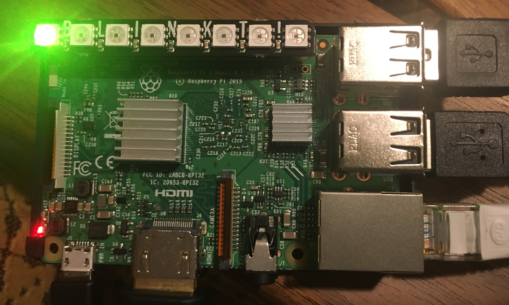
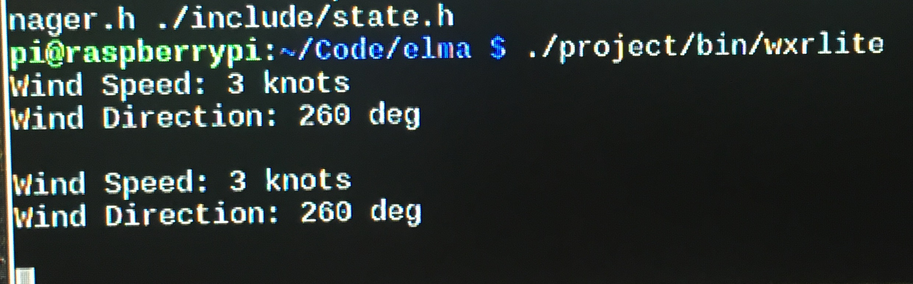

WXR-Lite
===

[WXR-Lite](https://github.com/jmccrmck1/WXR-Lite) is an example embedded systems project that demonstrates using the event loop and process manager libray "Elma" on a Raspberry Pi to pull weather data from a website to manipulate LEDs.

The source code for this project is available [on github](https://github.com/jmccrmck1/WXR-Lite).

Installation on Unix systems (e.g. Raspbian)
---

First install required packages available through apt-get

    sudo apt-get update
    sudo apt-get install -y cmake
    sudo apt-get install -y cppcheck
    sudo apt-get install -y graphviz
    sudo apt-get install -y doxygen
    sudo apt-get install -y cmake
    sudo apt-get install -y libssl-dev

Next, install Google Test (Optional)

    cd /usr/src
    sudo git clone https://github.com/google/googletest.git
    cd googletest
    sudo mkdir install
    cd install
    sudo cmake ../
    sudo make
    sudo make install

Next, install the json library

    sudo mkdir /usr/local/include/json
    cd /usr/local/include/json
    sudo curl -O -J -L https://github.com/nlohmann/json/releases/download/v3.5.0/json.hpp
    sudo mv json.hpp json.h

Next, install httplib library

    cd /tmp
    git clone https://github.com/klavins/cpp-httplib.git
    sudo mkdir /usr/local/include/httplib
    sudo mv /tmp/cpp-httplib/httplib.h /usr/local/include/httplib

Next, install bcm2835 library

download bcm2835-1.xx.tar.gz from: [www.airspayce.com/mikem/bcm2835/](www.airspayce.com/mikem/bcm2835/)

    cd ~
    tar zxvf bcm2835-1.xx.tar.gz
    cd bcm2835-1.xx.tar.gz
    ./configure
    make
    sudo make check
    sudo make install

Now you should be ready to install WXR-Lite! (few!)

    cd ~
    git clone https://github.com/jmccrmck1/WXR-Lite.git
    cd WXR-Lite
    make
    make docs

Execution
---
To run the WXR-Lite, type

    ./project/bin/wxrlite

Architecture
---
This project was designed with simplicity in mind given the timeframe and the unfamiliarity with using a Raspberry Pi, requesting data from a server, using Doxygen to generate project documentation and posting of the project to DockerHub.

This project used a Raspberry Pi 3B with Raspian Jamie installed along with a 1x8 RGB LED display that mounts directly on the GPIO port. Although Docker was installed on the RPi, I did not use that method to run the code and interface with the RPi GPIO port. Instead I manually installed elma from [GitHub](https://github.com/klavinslab/elma) following the Manual Installation instructions in that README file. With Make, Doxygen, Google Test, http library, json library and elma installed, the next step was installing the necessary libraries to control the LEDs, namely bcm2835 and clinkt (not strickly a library, files are included in this repo).

A process for obtaining weather data from a server and sending select values to the RPi LEDs was created (GetWXRdata). Within this process a server client is created for getting/calling a weather API for realtime weather data for Seattle, WA.  From that data wind speed and wind direction are extracted and sent to a method that manipulates the LEDs to reflect their values. The update rate of the weather data is not quick, perhpas on the order of 10 minutes.  Given that, the elma manager is scheduled to run the process every 5 minutes and a total run time of 60 minutes unless stopped by the user.

The number of knots per LED lit can be changed as desired but is set in this example at 2 knots/LED for a total of 16 knots max.  The wind direction can fall in 1 of 8 45 deg compass heading segments centered on N, NE, E, SE, S, SW, W and NW with each having the following assigned colors:

    N  - Gray
    NE - Blue
    E  - Lime
    SE - Cyan
    S  - Red
    SW - Magenta
    W  - Yellow
    NW - White

More elaborate LED matrix displays were desired for the project to better display the data but in the end a very simple and easy to install option with the Pimoroni Blitz! was used.  The desire was also to the use the NOAA Weather API but the call method was a little more complex and the json type was a little different.  With added time it could have been used but wasn't to save time.  Instead a simpler API call with openweathermap.org was used instead.

Results
---
Given time and the simplicity of elma structure, Google Tests were not written. Testing was accomplished using cout statements to verify json data was recieved and wind data was extracted and converted to numbers and cenverted again to the correct units before sending to the LED method.

Below is an example json return of the Current Weather API from openweathermap.org:

    {
    "base": "stations",
        "clouds": {
            "all": 40
        },
        "cod": 200,
        "coord": {
            "lat": 47.61,
            "lon": -122.33
        },
        "dt": 1553403523,
        "id": 5809844,
        "main": {
            "humidity": 62,
            "pressure": 1022,
            "temp": 48.63,
            "temp_max": 52,
            "temp_min": 45
        },
        "name": "Seattle",
        "sys": {
            "country": "US",
            "id": 5798,
            "message": 0.0092,
            "sunrise": 1553349980,
            "sunset": 1553394323,
            "type": 1
        },
        "visibility": 16093,
        "weather": [
            {
                "description": "scattered clouds",
                "icon": "03n",
                "id": 802,
                "main": "Clouds"
            }
        ],
        "wind": {
            "deg": 350,
            "speed": 3.36
        }
    }

The output of the project is the wind speed and wind direction sent to the terminal and the corresponding number of LEDs lit with the appropriate color on the RPi LED display.

Acknowledgements
---
Pirouz Naghavi:
- a great sounding board for my ideas
- helped answer git related questions
- helped answer project file structure related questions
- helped give ideas for some of my compiling errors
- colaborated on figuring out some of the doxygen html details
- colaborated on ordering Blinkt! LED effector and jumper wires
- colaborated on finding and using the Weather API
- colaborated on getting RPi up and running

References
---
WEBSITES:

Raspberry Pi Related:

[www.adafruit.com](https://www.adafruit.com) - Great resource for sensors and effectors and other RPi supplies. Also has a [tutorial](https://learn.adafruit.com/adafruits-raspberry-pi-lesson-6-using-ssh/overview) for setting up SSH.

[www.raspberrypi.org/documentation/remote-access/](https://www.raspberrypi.org/documentation/remote-access/)  - Resource for helping to find IP address of RPi and also for remote-access methods such as SSH.

[raspberrypi.stackexchange.com](https://raspberrypi.stackexchange.com/questions/42929/how-to-safely-switch-off-the-raspberry-pi/42945) - Answers for how to properly shutdown your RPi.

[shop.pimoroni.com/products/blinkt](https://shop.pimoroni.com/products/blinkt) - The LED effector used with RPi for this project, an eight RGB LED indicator, cheap @ $6/ea at [adafruit.com](www.adafruit.com/?=Blinkt!), and simple to install.

[medium.freecodecamp.org](https://medium.freecodecamp.org/the-easy-way-to-set-up-docker-on-a-rspberry-pi-7d24ced073ef) - Great reference on how to easily setup docker on a RPi.

[pimylifeup.com/raspberry-pi-visual-studio-code/](https://pimylifeup.com/raspberry-pi-visual-studio-code/) - Great guide. Raspberry Pi Visual Studio Code: Installing VS Code on Raspbian, By Gus, Sep 19 2018, updated Feb 17, 2019.

[stackoverflow.com/questions/30059784/docker-access-to-raspberry-pi-gpio-pins](https://stackoverflow.com/questions/30059784/docker-access-to-raspberry-pi-gpio-pins) - Great resource on how to access RPi GPIO pins when using Docker. I did not do this but if I had time I would have.

Implementation:

[www.rapidtables.com/web/color/RGB_Color.html](https://www.rapidtables.com/web/color/RGB.html) - Excellent reference for RGB Color Codes. Really helped in choosing colors for compass heading correlation.

[www.elecfreaks.com](https://www.elecfreaks.com/learn-en/starter_kit_case_13) - Example project that gave ideas of how I could implent my compass heading color correlation.

[www.calculateme.com](https://www.calculateme.com/speed/miles-per-hour/to-knots) - Provided quick factor to apply to convert from mph to knots.

Weather APIs:

[openweathermap.org/api](https://openweathermap.org/api) - The Weather API used for this project. Requires you make a free account which gives you access to Current weather data API among a few other weather APIs.  Your account comes with an API key that is required when making API calls. ***[FOR THIS CODE TO WORK, YOU WILL HAVE TO OBTAIN YOUR OWN API KEY TO APPEND TO THE END OF YOUR API CALLS]*** (mine has not been provided ;) ) 

[www.programmableweb.com](https://www.programmableweb.com/news/top-10-weather-apis/analysis/2014/11/13) - Top 10 Weather APIs, By Janet Wagner. Provided weather API options for project.

[www.weather.gov](<https://www.weather.gov/documenttation/services-web-api#/default/get stations%20 stationld%20 observations latest>) - NOAA's API Web Service, the runner up to the API used for this project.

LIBRARIES:

clinkt - Github:

[github.com/DianaProbst/clinkt] (https://github.com/DianaProbst/clinkt) - DianaProbst's clinkt repository provided a C++ ported version of the Python Library blinkt for the Pimoroni Blinkt LED display (and related APA102 pixel strips) on the Raspberry Pi.  This library was instrumental for getting LED functionality on the Raspberry Pi using C++.

bcm2835 - Other:

[www.airspayece.com/mikem/bcm2835/](www.airspayce.com/mikem/bcm2835) - C library for Boadcom BCM 2835 as used in Raspberry Pi. This is a required library when using the clinkt library, per the clinkt README.md file. Library is analagous to [WiringPi](wiringpi.com).

[raspberry-projects.com/pi/programming-in-c/io-pins/bcm2835-by-mike-mccauley](https://raspberry-projects.com/pi/programming-in-c/io-pins/bcm2835-by-mike-mccauley) - Resource on how to install the library correctly. Helped when troubleshooting library linker errors.

[stackoverflow.com](https://stackoverflow.com/questions/4130681/undefined-reference-maybe-makefile-is-wrong) - Helped me recognize why I was getting undefined reference errors.

"# WXR-Lite" 
